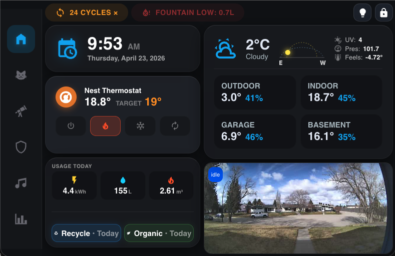
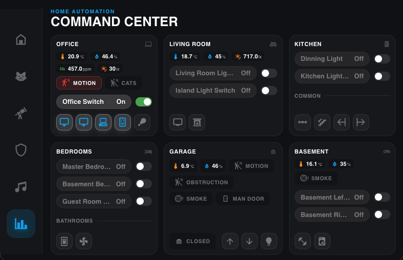
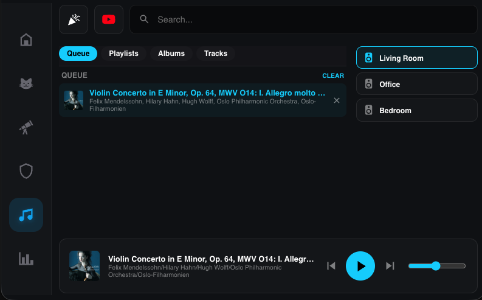
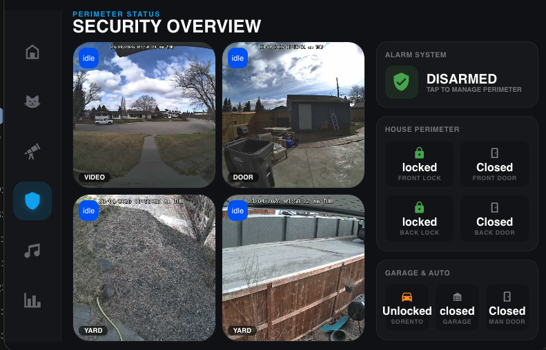
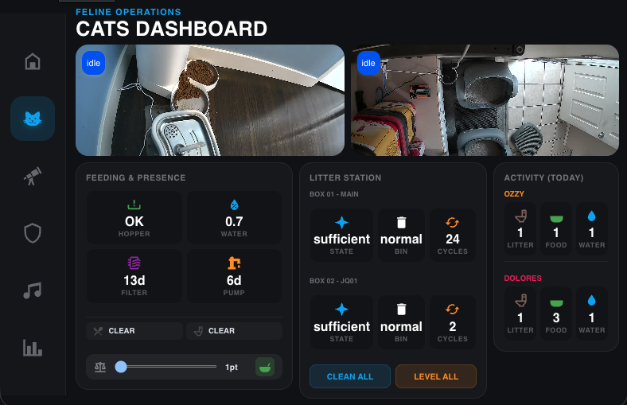
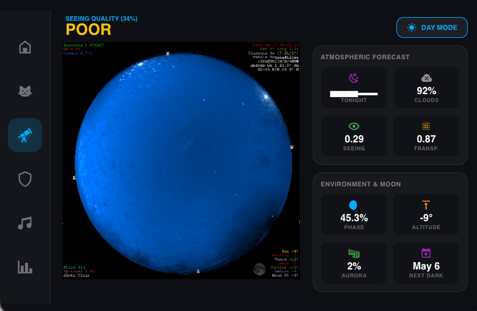
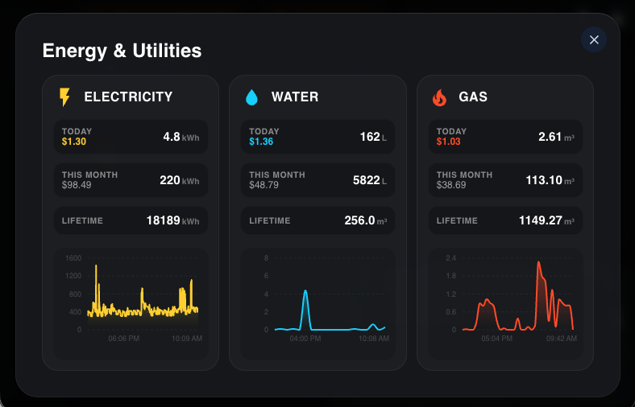

# Jerry's Home Assistant Dashboard

A personal smart home dashboard built on top of [ha-component-kit](https://shannonhochkins.github.io/ha-component-kit/), running as a custom panel inside Home Assistant. Built with React, TypeScript, and Vite.

## Dashboards

| View | Description | Screenshot |
|---|---|---|
| **Main** | Primary hub — cameras, climate, environment sensors, badge tray, house operations |  |
| **Command Center** | Full control panel with lights, locks, covers, and quick actions |  |
| **Media** | Media player controls (Music Assistant via proxy) |  |
| **Security** | Lock grid and security status |  |
| **Cats** | Cat feeding area and litter box monitoring |  |
| **Astro** | Sunrise/sunset and celestial data |  |
| **Utilities** | Energy and utility metrics |  |

The `AutoDashboardController` watches specific entity states (e.g. litter box occupancy, feeding area presence) and automatically switches the active view, returning to the previous view after a timeout.

## Tech Stack

- **React 19** + **TypeScript**
- **Vite** for bundling
- **@hakit/core** + **@hakit/components** for HA entity bindings and pre-built cards
- **Recharts** for metric charts
- **react-simple-keyboard** for on-screen keyboard
- **Storybook** for isolated component development

## Prerequisites

- [NVM](https://github.com/nvm-sh/nvm) (Node version manager)
- Node.js ≥ 18 and npm ≥ 7 (`.nvmrc` pins the exact version)

## Environment Setup

Copy `.env.development` and fill in your values:

```bash
VITE_HA_URL=https://your-ha-instance.local
VITE_HA_TOKEN=<long-lived access token>   # dev/sync only — do not bundle into prod
VITE_SSH_USERNAME=<ha ssh user>
VITE_SSH_PASSWORD=<ha ssh password>
VITE_SSH_HOSTNAME=<ha host or IP>
VITE_FOLDER_NAME=ha-dashboard             # folder created under /config/www/
```

> **Important:** `VITE_HA_TOKEN` in `.env.development` is never bundled into the production build. If you intentionally want it bundled, move it to `.env` and read the [security warning](https://shannonhochkins.github.io/ha-component-kit/?path=/docs/introduction-deploying--docs#important) first.

## Local Development

```bash
nvm use
npm install
npm run dev
```

Starts Vite dev server with HMR. The HA WebSocket connection is authenticated via `VITE_HA_TOKEN` in `.env.development`, so no manual login is needed locally.

A proxy for Music Assistant is pre-configured at `/mass-api` → `http://homeassistant.local:8095`.

## TypeScript Sync

Generates typed entity names from your live HA instance:

```bash
npm run sync
```

Requires `VITE_HA_URL` and `VITE_HA_TOKEN` to be set. The generated types file must then be referenced in `tsconfig.json`. See the [full instructions](https://shannonhochkins.github.io/ha-component-kit/?path=/docs/introduction-typescriptsync--docs).

## Building

```bash
npm run build
```

Runs Prettier, then TypeScript compilation, then Vite. Output goes to `./dist`. The `base` path is automatically set to `/local/<VITE_FOLDER_NAME>/` so all asset URLs resolve correctly once deployed.

## Deploying to Home Assistant

```bash
npm run deploy
```

Uploads the `./dist` directory to your HA instance over SSH at `/config/www/<VITE_FOLDER_NAME>/` (also tries `/homeassistant/www/` for newer HA installs). Any existing remote directory is wiped before upload to keep the deployment clean.

After deploying, visit:

```
https://<your-ha-url>/local/<VITE_FOLDER_NAME>/index.html
```

Or follow the [ha-component-kit addon guide](https://shannonhochkins.github.io/ha-component-kit/?path=/docs/introduction-deploying--docs) to add it as a sidebar panel.

## Storybook

```bash
npm run storybook
```

Runs on port 6006. Component stories live in `./stories/`. Tests are powered by Vitest + Playwright (headless Chromium).

## Further Reading

- [ha-component-kit documentation](https://shannonhochkins.github.io/ha-component-kit/)
- [Deploying guide](https://shannonhochkins.github.io/ha-component-kit/?path=/docs/introduction-deploying--docs)
- [TypeScript Sync guide](https://shannonhochkins.github.io/ha-component-kit/?path=/docs/introduction-typescriptsync--docs)
